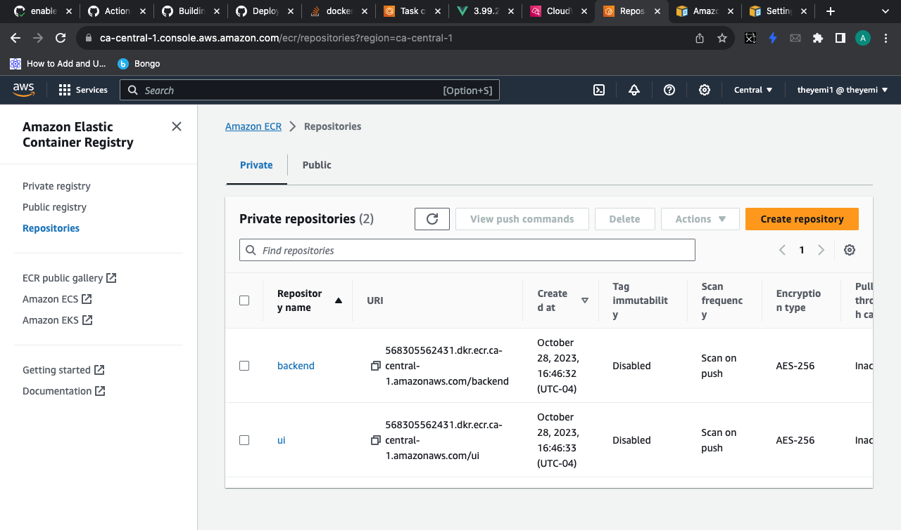
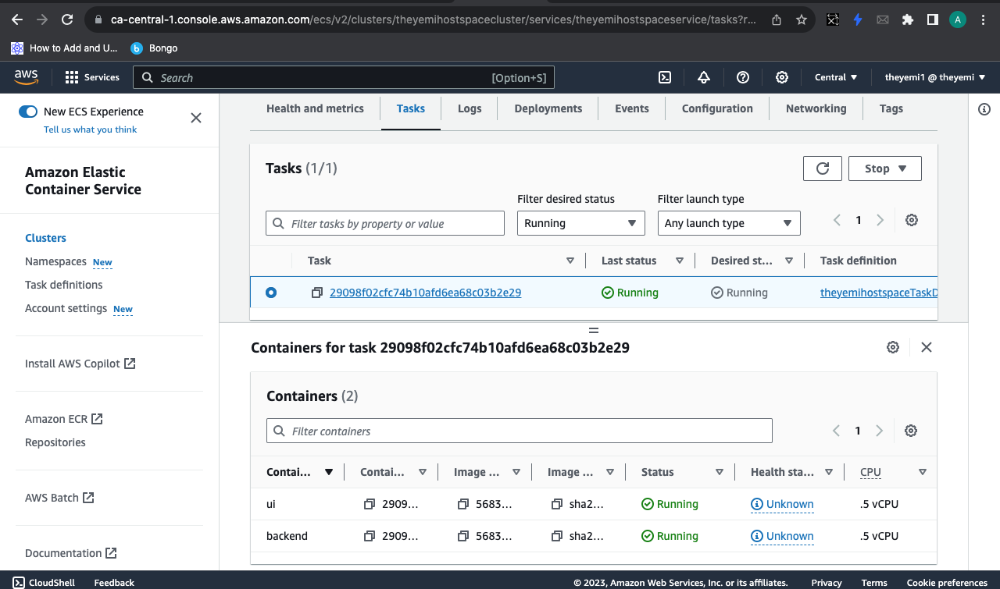
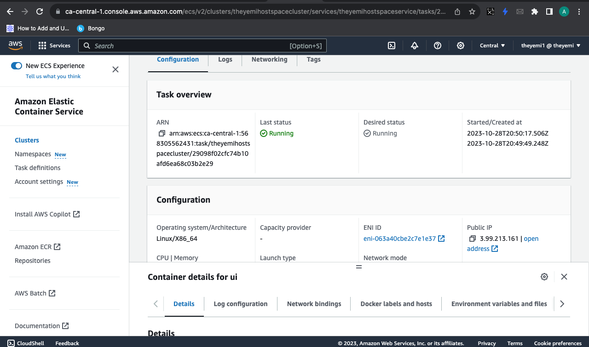
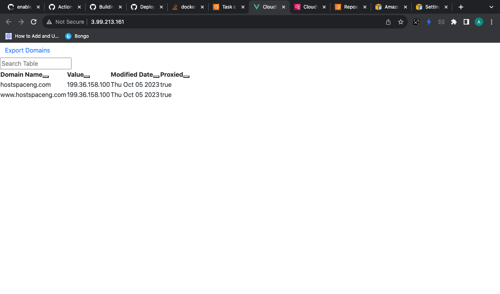
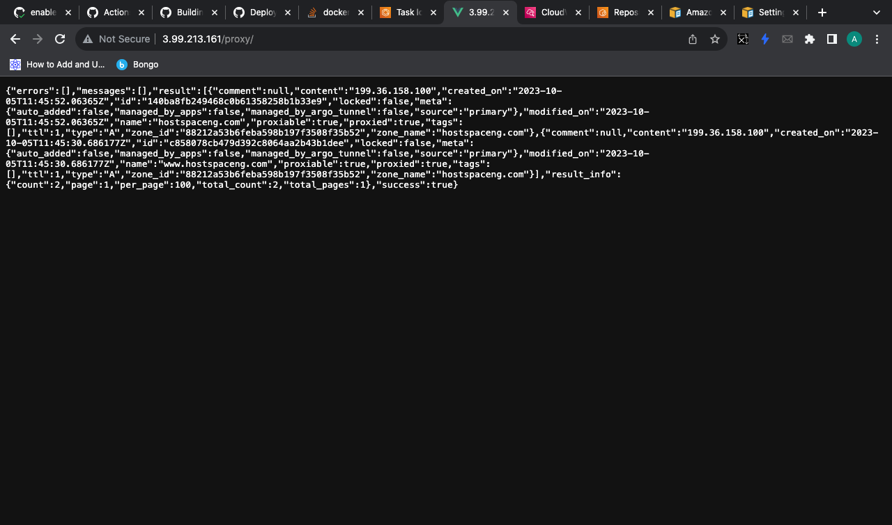
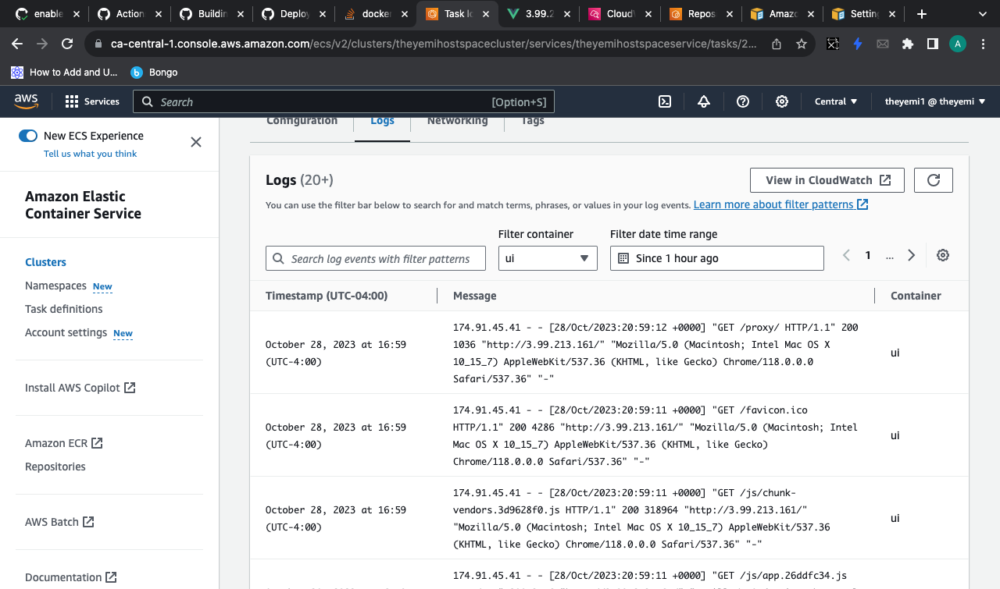
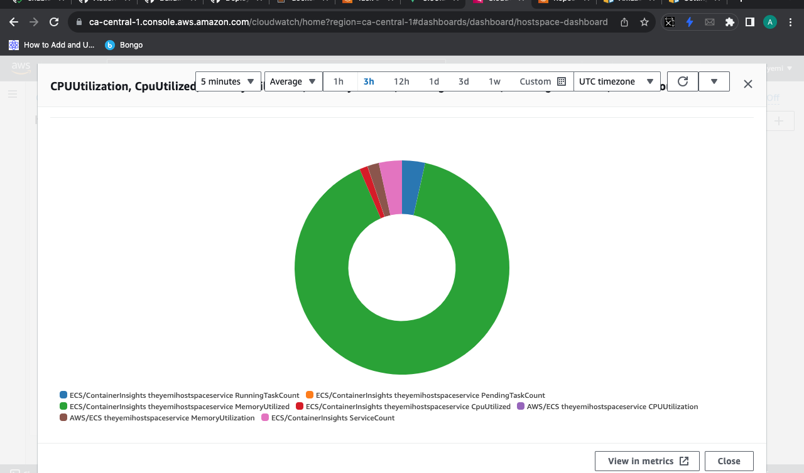

**Title:** [Submission] - Adeyemi Joshua Adepoju

**Description:**

<!-- Provide a detailed summary of the changes included in this submission. Explain the problem you aimed to solve, the solutions you implemented, and the results achieved. Include any challenges faced and how they were overcome. -->

This solution containerizes a fullstack application written in vue.js for the frontend and python flask framework for the backend with Nginx as a reverse proxy. I implemented Docker iamges and containers for both frontend and backend applications and storing the images in Aws Elastic container registry and deploying the containers on Aws container service using the fargate option. I utilized Terraform as the Infrastructure as code tool to configure the Aws infrastructure for the ECR, ECS, Services and Task definitions including networking configurations using Awsvpc.

---

### Solution Details

**Dockerfile & Application Configuration:**
<!-- - Briefly describe how the Dockerfile was structured and how the application was configured, including any optimizations or specific configurations used. -->

For the frontend, the dockerfile can be found in the frontend directory. This is a multi-stage dockerfile using node as the base image, installing npm and running the build all in the "build stage". In the "production stage", Nginx is used as the base image. The built application is stored in the /app/dist directory which is then sent to the /app/dist directory in Nginx. This directory is set as the root directory for Nginx to serve the index.html file. This configuration can be found in the Nginx.conf file. It is also worth noting that in the "production stage", the default Nginx.conf file as been replaced with our custom Nginx.conf file.

For the backend, python is used as the base image, the requirements.txt file which contains the required modules is copied and are installed using pip, a python package manager.The image is set to expose the port 5000 and the command runs the main.py file using flask.

**CI/CD Pipeline:**
<!-- - Explain the CI/CD pipeline’s flow, including the build, test, and deployment stages. Specify the tools and services used, and the reasons for choosing them. -->

For the CI/CD pipeline, Github actions was the preffered tool.GitHub Actions is a powerful and flexible platform for automating various aspects of the software development workflow.It is tightly integrated with the GitHub platform, making it a natural choice as the code repository is hosted on GitHub.

The pipeline is triggered to run on push to the main branch. It includes a job with steps to build the docker images and push to Aws Elastic Container Registry, login to ECR, configure credential and deploy to Aws Elastic Container Service.

The first step in the pipeline is to checkout using git, followed by configuring the AWS credentials to verify the Aws user account. For security purpose, the access key and secret key are stored in the repository's github actions environment variables.  

If the above step is successful, the pipeline invokes a login to ECR then builds the docker iamges using docker compose and pushes the images to ECR. After this step, the pushed images are filled in a new image ID in the Amazon ECS (Elastic Container Service) task definition. The purpose of this step is to update the task definition in Amazon ECS to use the new Docker image that has been built. The last step starts up the containers in ECS by running the task using the provided task definition.

**Infrastructure as Code (IaC):**
<!-- - Provide information on the IaC scripts or tools used for provisioning and deployment. Include details of the deployment platform or cloud service utilized. -->

The Cloud infrastructure for this task was set up using Terraform as the infrastructure as code tool with Amazon Web Service (Aws) as the preffered cloud provider. The services needed for this Task is very minimal as i only needed to set up the Aws Container Registry, Container Service, Clusters and create a task definition.

The Container Registry Stores the Container Images of both the frontend and backend applications.The cluster for the Elastic container service includes container insights and is run with the fargate serverless option. You can think of a cluster as a virtual cluster of compute resources that are used to run your containers.Since the deployment option uses fargate, we also need to set up networking by inlcuding the subnets and security groups. The subnets and security group included in my code have previously been created so i just included their IDs.

The Task definition includes the list of the containers with the required compute capacity to run each container. A task definition is a blueprint that describes how a Docker container should run within a service or a task. It is a fundamental concept in ECS and contains all the necessary information to launch one or more containers as part of a task within an ECS service or a standalone task.
 The total amount of memory and cpu of these containers should not excedd the total amount of the overall memory and cpu provisioned for the container service.

**Monitoring Setup (Bonus):**
<!-- - If implemented, describe the monitoring tools and configurations used. Include any custom dashboards or alerts set up to track application and infrastructure health. -->

Recall that container insights is enabled for the Ecs cluster. With container insights enabled, cloudwatch automatically monitors and allows us to gain insights into the containerized applications. It provides in-depth visibility into the performance, resource utilization, and logs of the containers, making it easier to manage and optimize the containerized workloads.

The metrics set up to monitor the containerized application are:
CPU UTILIZATION
MEMORY UTILIZATION
RUNNING TASK COUNT - Number of running tasks
PENDING TASK COUNT - Number of pending tasks

**Screenshots/Links (if applicable):**
- Include screenshots or links showcasing the deployed application, CI/CD pipelines, and monitoring dashboards.

---

---

---

---

---

---

### Testing the Solution

Provide clear instructions on how the evaluators can test and verify your solution. Include steps to:

1. Clone your forked repository.
in your terminal, run 
git clone https://github.com/The-indigo/hostspace

2. Build and run the application using the provided Dockerfile.
Pre-requisites : Docker, Docker compose
cd into the project directory. 
Run 
docker compose up
or to run the containers in the background
docker compose up -d
(p.s: if you are not running docker on your local machine i.e(running on ec2 instance), replace the proxy_pass for the "/proxy" location in the nginx.conf file to http://{public_ip_address}:5000. or 
http://backend:5000. make sure it's reconfigured to http:localhost:5000 for the deployment step)
3. Deploy the application using the IaC scripts.
Cd into the terraform folder, ensure you already set your AWS credentials.
run terraform apply 
After this command runs successfully, make a push request to main branch to run the ci/cd pipeline to run the pipeline to build and deploy the docker images and containers
4. Access and test the application’s functionality.
In the Aws console,type Ecr in the search bar and click Elastic container registry to go to the Erc page. Check that the docker image is stored in the respective repository (backend and ui)
Enter Ecs in the dashboard and click Elastic container servie. Click on clusters > theyemihostspacecluster
In the task tab, click on the running task , copy the public ip and paste in your browser to view the application running.

---

**Checklist:**
- [x ] The submission follows the format specified in the challenge instructions.
- [x ] The Dockerfile builds successfully and is optimized.
- [x ] The CI/CD pipeline is complete and functional.
- [x ] The IaC scripts are modular and reusable.
- [x ] The README file is clear and comprehensive.
- [x ] (Bonus) The monitoring setup is functional and comprehensive.

By submitting this pull request, I confirm that my contribution is made under the terms of the challenge’s requirements.
